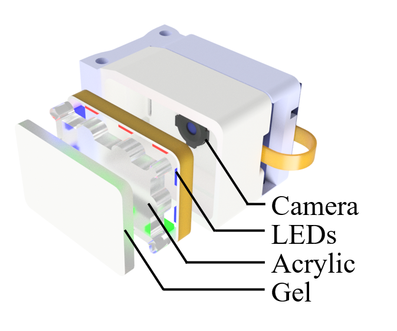
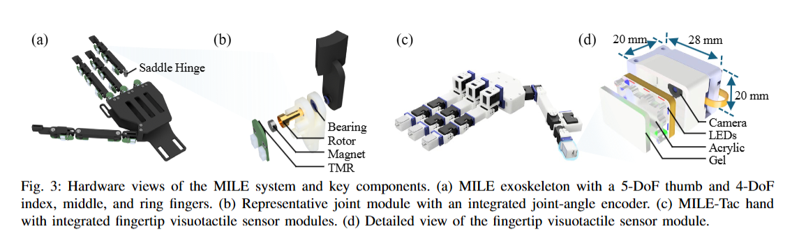

# MILE Fingertip Visuotactile Sensor

CAD files, material references, and fabrication instructions for the fingertip visuotactile sensor used in **MILE: A Mechanically Isomorphic Hand Exoskeleton and Visuotactile Robotic Hand for Data Collection in Dexterous Manipulation**.

[MILE project page](https://sites.google.com/view/mile-system) · [Bill of materials](BOM/BOM.xlsx)

## Sensor overview

The module combines a compliant silicone sensing layer, a reflective coating, a transparent acrylic support, internal LED illumination with an ATtiny85-based controller, a miniature RGB camera with a **120° fixed-focus lens**, and printed structural parts. Each sensor uses **eight LEDs**. The three illumination directions use red, green, and blue light, respectively.



*Sensor exploded view corresponding to Fig. 3(d) of the MILE manuscript.*



*Fig. 3 of the MILE manuscript. Panel (d) shows the fingertip sensor, with a nominal envelope of 20 × 28 × 20 mm.*

## Released files

| File | Description |
| --- | --- |
| [assembly.STEP](CAD/STEP/assembly.STEP) | Sensor assembly |
| [baseCamera.STEP](CAD/STEP/baseCamera.STEP) | Camera-side structural component |
| [baseConnector.STEP](CAD/STEP/baseConnector.STEP) | Connecting structural component |
| [acrylic.STEP](CAD/STEP/acrylic.STEP) | Geometry of the 3 mm transparent acrylic support |
| [acrylic.DXF](CAD/DXF/acrylic.DXF) | Laser-cutting outline for the 3 mm acrylic support |
| [camera.STEP](CAD/STEP/camera.STEP) | Camera geometry reference |
| [GelMode.STEP](CAD/STEP/GelMode.STEP) | Silicone casting mold, printed in PLA |
| [BOM.xlsx](BOM/BOM.xlsx) | Components, consumables, and supplier references |
| [Illumination assembly and wiring](docs/led-wiring.md) | Assembly reference photographs and soldering instructions |

This release covers mechanical designs, material references, fabrication, and hardware assembly.

## Materials and supplier references

Silicone, coatings, adhesives, wires, and printing materials are shared consumables. Links were supplied by the authors; confirm product options before purchase.

| **Component or material** | **Specification / role** | **Supplier reference** |
| --- | --- | --- |
| Silicone elastomer | Smooth-On Solaris; MILE recipe: A:B = **1:2 by mass** | [Listing](https://e.tb.cn/h.8CfLBqZ0Gq6BevB?tk=VI4yTMjDRcV) |
| Mold release agent | Coat the internal casting surfaces | [Listing](https://item.taobao.com/item.htm?id=39270711126) |
| Transparent silicone adhesive | Bond the uncoated gel surface to acrylic | [Listing](https://item.taobao.com/item.htm?id=593987256695) |
| White thermally conductive adhesive | Fix the camera after focusing | [Listing](https://item.taobao.com/item.htm?id=600594258578) |
| Gray silicone coating ink | Request custom **coolgray** | [Listing](https://item.taobao.com/item.htm?id=594951473152) |
| Coating thinner | Compatible thinner from the coating supplier | [Listing](https://item.taobao.com/item.htm?id=594951473152) |
| LED strip | 2.6 mm wide; **8 LEDs per sensor**; three illumination directions use red, green, and blue | [Listing](https://item.taobao.com/item.htm?id=570411659913) |
| LED controller | ATtiny85-based controller board | [Listing](https://detail.tmall.com/item.htm?id=654071116354) |
| Camera | **120° fixed-focus module with small board** | [Listing](https://item.taobao.com/item.htm?id=713113178023) |
| 3D printing filament | Bambu PLA Basic; used to print the silicone casting mold and sensor structural parts | [Listing](https://e.tb.cn/h.8yFoHAKwVr1shmb?tk=97oXTMkPX9c) |

Additional procurement references for C-0030 silicone, silver ink, marker ink, and spray-gun cleaner are retained in `Sheet2` of the spreadsheet. They are not required additions to the recipe below.

## Fabrication and assembly

### 1. Prepare the mold and parts

1. Print [GelMode.STEP](CAD/STEP/GelMode.STEP) in PLA to make the silicone casting mold.
2. Temporarily seal the mold's open bottom with a flat acrylic plate to prevent leakage during casting and curing. The open-bottom design facilitates removal of the cured silicone layer. This sealing plate is separate from the sensor's acrylic support.
3. Apply mold release agent to the internal casting surfaces, following the release agent's instructions.
4. Print `baseCamera` and `baseConnector` in PLA.
5. Cut the sensor support from **3 mm transparent acrylic** using [acrylic.DXF](CAD/DXF/acrylic.DXF). Import the drawing in millimeters without scaling.

### 2. Mix, degas, and cast the silicone

1. Weigh Solaris A and B at **A:B = 1:2 by mass**. For example, combine 10 g of A with 20 g of B.
2. Mix thoroughly with a mixer or manually with a spoon/spatula, incorporating the material along the container walls and bottom.
3. Degas in a vacuum chamber until bubbles introduced during mixing are removed. Leave space for the mixture to expand during degassing.
4. Pour the degassed mixture into the prepared mold, minimizing new bubbles.
5. Leave the filled mold in a **45°C temperature-controlled chamber for 24 h**, following the authors' laboratory fabrication procedure.
6. Demold the transparent silicone layer and check the optical region for bubbles and defects.

**Formulation selection:** Section III-C of the manuscript specifies A:B = 1:2 by mass. Supplementary Section IV-B describes screening ten ratios using compression force-displacement responses and qualitative observations of clarity, recovery, tackiness, and fabrication stability. The selected formulation is a practical compromise for this sensor, rather than a universal optimum.

The [manufacturer's technical bulletin](https://www.smooth-on.com/tb/files/Solaris_TB.pdf) specifies a standard 1:1 formulation. The **1:2 formulation above is the experimentally selected MILE recipe**. The 45°C / 24 h schedule is the laboratory procedure supplied by the authors.

### 3. Apply the reflective coating

1. Weigh gray ink stock and its compatible thinner at **ink:thinner = 1:3 by mass**.
2. Add the curing agent supplied with the ink at the supplier's specified dose, mix thoroughly, then use a spray gun to deposit a thin, uniform film on the contact-facing silicone surface. The curing-agent dose is separate from the ink-to-thinner ratio.
3. Make the coating uniform and opaque. Avoid excessive thickness, which can reduce sensing sensitivity according to the authors' fabrication observations.
4. Allow the coating to dry for approximately **8 h at room temperature**, or accelerate drying with a heat gun. Ensure that the coating is fully dry before assembly.

Leave the opposite gel surface uncoated for bonding to acrylic.

### 4. Assemble illumination, acrylic, and gel

1. Assemble the acrylic support and LED-strip segment containing **eight LEDs** according to the exploded view and assembly CAD. The three illumination directions use **red, green, and blue** light. Secure the support in the middle of the sensor structure.
2. Route the LED wires through the opening in the housing, solder them to the appropriate strip pads and controller terminals, and check the illumination before bonding the gel. Follow the actual supply, ground, and data-input labels. See [assembly photographs and soldering instructions](docs/led-wiring.md).
3. Use transparent silicone adhesive to bond the **uncoated side** of the gel to acrylic. Avoid trapped air in the optical interface.
4. Allow approximately **8 h at room temperature** for the bond to cure, following the authors' procedure for the selected adhesive. Check the bond before continuing.

### 5. Install and focus the camera

1. After the gel-to-acrylic bond has cured, insert the camera into the structure's viewing opening.
2. With illumination on and the camera image displayed, adjust focus for the clearest view of the sensing surface at the assembled distance.
3. Fix the camera with thermally conductive adhesive. Keep adhesive away from the lens and optical path, and preserve the focused camera pose during fixation.
4. After fixation, check illumination coverage, image focus, and visible image changes under gentle contact.

## Maintenance

The modular construction allows the gel and camera to be replaced separately. Replace a damaged gel while retaining the camera, or replace and refocus a damaged camera while retaining the gel. During removal, protect the illumination assembly and the gel or camera being retained. The acrylic support can be replaced as needed.

## Citation

Please cite the associated [MILE arXiv preprint](https://arxiv.org/abs/2512.00324). A downloadable BibTeX entry is provided in [citation.bib](citation.bib).

```bibtex
@misc{du2025milemechanicallyisomorphicexoskeleton,
  title         = {MILE: A Mechanically Isomorphic Hand Exoskeleton and Visuotactile Robotic Hand for Data Collection in Dexterous Manipulation},
  author        = {Jinda Du and Jieji Ren and Qiaojun Yu and Ningbin Zhang and
                   Yu Deng and Xingyu Wei and Yufei Liu and Guoying Gu and
                   Xiangyang Zhu},
  year          = {2025},
  eprint        = {2512.00324},
  archivePrefix = {arXiv},
  primaryClass  = {cs.RO},
  url           = {https://arxiv.org/abs/2512.00324}
}
```
