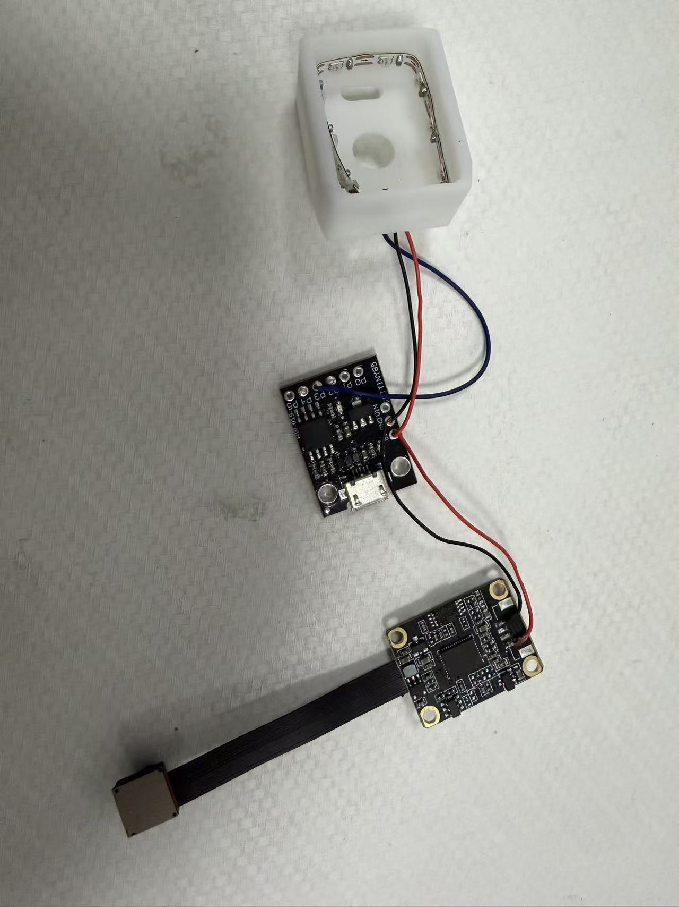
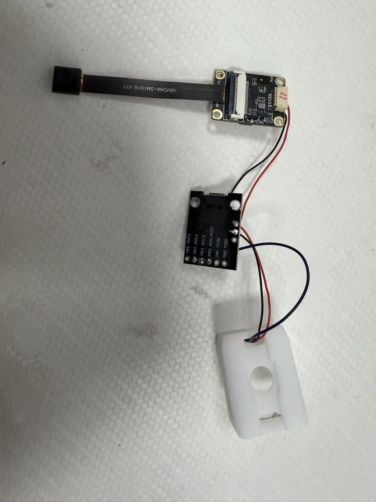

# Illumination assembly and wiring

The photographs below show the sensor's LED strip seated inside the printed housing, the ATtiny85 controller board, and the camera board. Each sensor uses **eight LEDs**, with **red, green, and blue illumination from three directions**. The camera uses a **120° fixed-focus lens**. The photographs document the physical assembly and wire routing. The controller and strip terminal labels must be checked before reproducing the electrical connections; wire colors alone are insufficient to establish a pinout.

## Assembly photographs

*Front view of the illumination assembly and connected boards. The LED strip follows the inner perimeter of the housing, and the wires leave through the housing opening.*

*Reverse view showing the controller-board labels and the routing of the connections. The red and black leads run between the boards and the housing; the blue lead runs between the controller and the housing.*

## Soldering and assembly

1. Position the strip segment containing eight LEDs along the inner perimeter of the housing as shown in the photographs and assembly CAD. The three illumination directions use red, green, and blue light. Follow the strip's permitted bend and cut locations.
2. Identify the strip supply, ground, and input pads from their actual markings. Record its rated voltage and input direction before soldering.
3. Route flexible wires through the housing opening. Leave sufficient length for assembly and servicing without pulling on the solder joints.
4. Solder each wire to its corresponding LED-strip pad and controller connection. Keep joints compact and avoid solder bridges between adjacent pads. The photographs show the physical arrangement; they do not replace a verified electrical pinout.
5. Check continuity and ensure that supply and ground are not shorted before powering the assembly. Insulate exposed connections where needed and keep wires clear of the camera opening and acrylic seating surfaces.
6. Check the illumination with the actual rated supply and controller configuration before fixing the acrylic support and bonding the gel.

## Connection roles

For a strip confirmed to use a single digital data input:

| Connection | Role |
| --- | --- |
| LED-strip supply pad | Connect to the supply rated for the strip. Use 5 V only when the strip is specified for 5 V. |
| LED-strip ground | Connect to controller ground and supply ground. |
| First LED's `DIN` / `DI` | Connect to the appropriate controller output. Follow the strip's input direction and the actual board-pad mapping. |
| Last LED's `DOUT` / `DO`, if present | Leave unconnected unless another strip segment follows. |

The strip's power current must be supplied through an adequate power path, rather than a microcontroller GPIO. If the strip has an analog or clocked interface, use its corresponding driver connections instead of the single-data-input arrangement above.

The photographs show additional red/black connections between the controller and camera boards. Check the camera-board terminal labels and power circuit before reproducing those connections. They do not establish a camera data connection to the ATtiny85.

The LED count is eight per sensor. The LED IC, rated voltage, electrical pinout, and color-to-side assignment still need confirmation. No GPIO number or LED protocol is assigned solely from these photographs.
